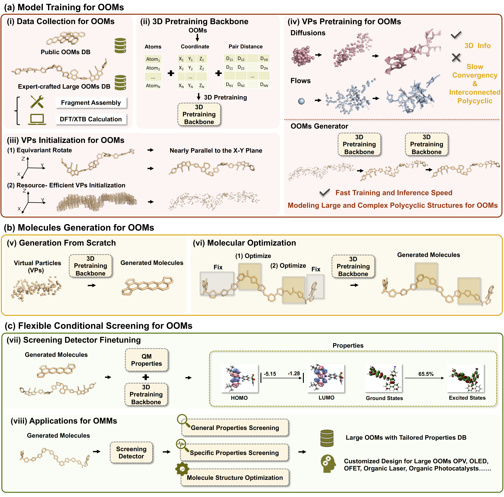

# Rapid-3D-Inverse-Design-Framework-for-Organic-Optoelectronic-Materials-via-Virtual-Particles

## Overview

Organic optoelectronic devices are increasingly important in clean electricity production and information display due to their flexibility, foldability, low-cost, and environmental friendliness. Their performance relies on the rich π-electron photoelectric active materials with conjugated fused-ring structures. However, discovering new superior materials remains a critical challenge in these fields.
We introduce **O2-GEN**, a novel framework for rapidly designing complex conjugated molecules by high-throughput inverse design. Public and expert-curated datasets of 2 million organic optoelectronic molecules are leveraged for 3D pretraining to capture unique chemical spaces. Using virtual particle sampling, our generator achieves nearly 100% validity and novelty, generating molecules 53 times faster than Diffusion and Flow models and improving ring structure distribution by 161.43%, while also allowing molecular customization. Our screening detector identifies superior molecules with near Density Functional Theory accuracy. Experiments show the framework efficiently designs high-performance polycyclic molecules, providing a powerful tool for accelerating the discovery of new materials.

## Framework

## Code and Data

Due to the large size of the data, this repository only displays part of the code. We have made both the data and the code available at the following links.

The data can be accessed through Zenodo at [https://doi.org/10.5281/zenodo.11063203](https://doi.org/10.5281/zenodo.11063203) and Figshare at [https://doi.org/10.6084/m9.figshare.25687290.v1](https://doi.org/10.6084/m9.figshare.25687290.v1). Some screened molecules from the case study can be accessed through Figshare at [https://doi.org/10.6084/m9.figshare.26144065.v1](https://doi.org/10.6084/m9.figshare.26144065.v1).

The code and corresponding weights for our 3D pretraining backbone are available at Zenodo: [https://doi.org/10.5281/zenodo.11063109](https://doi.org/10.5281/zenodo.11063109). The code and weights for our detector can also be accessed via Zenodo at [https://doi.org/10.5281/zenodo.11063203](https://doi.org/10.5281/zenodo.11063203). Additionally, the generator’s code and associated weights can be accessed via Figshare: [https://doi.org/10.6084/m9.figshare.25687290.v1](https://doi.org/10.6084/m9.figshare.25687290.v1). **If you encounter a 403 Forbidden error when accessing Figshare, you can alternatively visit the following links:**

- [https://doi.org/10.6084/m9.figshare.25687290.v1](https://doi.org/10.6084/m9.figshare.25687290.v1) → [Google Drive Link](https://drive.google.com/drive/folders/100RbKYhNM3aarLCGoLJjZ9O0tj75-MxV)
- [https://doi.org/10.6084/m9.figshare.26144065.v1](https://doi.org/10.6084/m9.figshare.26144065.v1) → [Google Drive Link](https://drive.google.com/drive/folders/1tTQ3YO_84GhhRV0pUFECYVsQIDA4WCeX?usp=sharing)

These resources are provided to enable replication of the results presented in this study.

## Reimplementation

The code is implemented in PyTorch. The code is organized into three main parts: Detector_Finetune, Generator, and Pretraining_Backbone.

Pretraining_Backbone：The code for the 3D pretraining backbone is provided in this folder.

Generator：The code for the generator is provided in this folder.

Detector_Finetune：The code for the detector is provided in this folder.

To reproduce the results, please follow the above data and code links.

Also, please refer to the README.md files in the Detector_Finetune, Generator, and Pretraining_Backbone folders for more details.

[Detector_Finetune/README.md](./Detector_Finetune/README.md)

[Generator/README.md](./Generator/README.md)

[Pretraining_Backbone/README.md](./Pretraining_Backbone/README.md)
